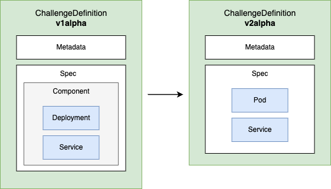
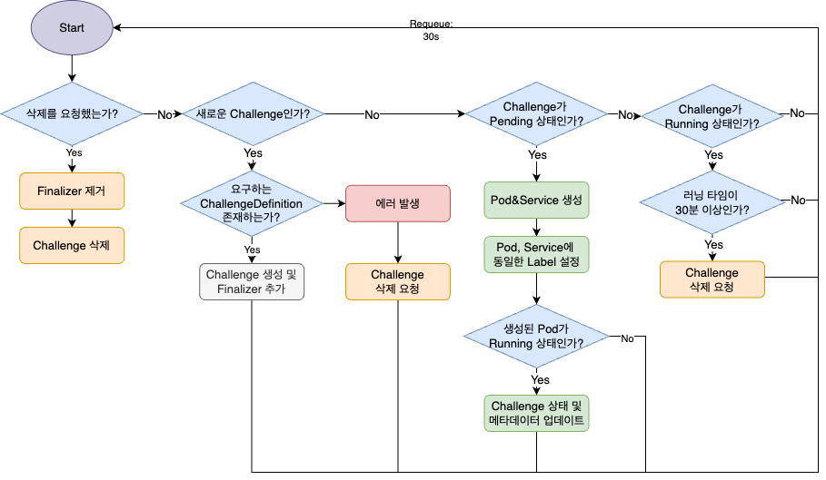

## Background 
For this project, we utilized containers extensively to create independent hacking game environments. However, deploying and managin challenges with containers at scale requires dedicated tooling. Rather than building an orcahestration solution from scratch, we choose to leverage Kubernetes, an open-source and widely adopted container orchestration platform.

Kubernetes offers powerful scalability, allowing not only the use of standard resources but also the creation and lifecycle management of custom resources through controllers. By capitalizing on these open-source features, we applied Kubernetes to streamline and automate our hacking competition operations platform.

## Features
- **Declarative Environment Creation**:Easily define unique, per-user CTF challenge environments using a YAML-based custom resource, just like standard Kubernetes manifests.
- **Kubernetes Native Experience**:Challenge specifications adopt Kubernetes Pod grammar, so anyone familiar with Kubernetes can create or modify challenge environments intuitively and rapidly.
- **Full Lifecycle Automation**:The operator handles the entire lifecycle—provisioning, management, and cleanup—of challenge resources, reducing human error and operational load.

## Concepts

### Custom Resource
> [!note]
> In `v2alpha1`, the structure of `ChallengeDefinition` was updated for simplicity. For more details, please read this [documentation](./changelog/v2alpha1.md).

- **ChallengeDefinition** is a custom Kubernetes resource used to define CTF challenges, including their environment, configuration.
- **Challenge** is a custom Kubernetes resource that provisions and manages a CTF challenge environment for a user. The Challenge Operator manages Challenge custom resources (CRs) and oversees their entire lifecycle.



### Controller 

#### Status 
| Status       | Description |
|--------------|-------------|
| **Pending**      | The `Challenge` object has been created from a valid `ChallengeDefinition` and is awaiting resource readiness. |
| **Running**      | All Kubernetes resources for the `Challenge` are active and running. |
| **Terminating**  | The `Challenge` is being removed — deletion requested and all associated Kubernetes resources are being cleaned up. |
| **Error**        | An error occurred during the Pending or Running state; the `Challenge` enters automatic cleanup (Terminating). |


#### Flow Chart
The diagram below visualizes the status transitions of a `Challenge`, helping you understand the complete lifecycle and automatic error handling.




## Quick start 
### Add CRD(ChallengeDefinition, Challenge)
```sh
cd challenge-operator
kubectl apply -f config/crd/bases
```

### Run Challenge-operator
In Kubebuilder projects, Kustomize files are included and managed internally by default. However, challenge operator integrates with third-party applications, such as message queues and logging systems, we customized the configuration and deployment setup to fit these additional dependencies.

```sh
# Download challenge-operator-kustomize
git clone https://github.com/S0okJu/challenge-operator-kustomize.git
cd challenge-operator-kustomize

# Build challenge-operator
kubectl apply -k
```

### Create ChallengeDefinition
The specification follows the same structure and syntax as standard Kubernetes [Pod](https://kubernetes.io/docs/concepts/workloads/pods/) and [Service](https://kubernetes.io/docs/concepts/services-networking/service/) manifests.
```yaml
apiVersion: apps.hexactf.io/v2alpha1
kind: ChallengeDefinition
metadata:
  name: ubuntu-basic
  namespace: challenge
  labels:
    apps.hexactf.io/challengeId: "1"
spec:
  resource:
    name: ubuntu-basic
    # the same structure and syntax as a standard Kubernetes Pod declaration.
    pod: 
      containers:
        - name: ubuntu
          image: ubuntu:22.04
          command: ["/bin/bash", "-c"]
          args:
            - |
              apt-get update && \
              DEBIAN_FRONTEND=noninteractive apt-get install -y \
                openssh-server \
                curl \
                wget \
                vim \
                net-tools \
                iputils-ping && \
              mkdir -p /run/sshd && \
              echo 'root:toor' | chpasswd && \
              sed -i 's/#PermitRootLogin prohibit-password/PermitRootLogin yes/' /etc/ssh/sshd_config && \
              /usr/sbin/sshd && \
              sleep infinity
          ports:
            - containerPort: 22
              protocol: TCP
    # the same structure and syntax as a standard Kubernetes Service declaration.
    service:
      spec:
        ports:
          - name: ssh
            protocol: TCP
            port: 22
            targetPort: 22
        type: NodePort
```

### Create Challenge
> [!note]
> This is a CTF toolset. If you want to use it in an automated way, you will need to implement an API to interact with it.
>
> In my case, I implemented my own [API](https://github.com/HexaCTF/challenge-api).

```yaml
apiVersion: apps.hexactf.io/v2alpha1
kind: Challenge
metadata:
  name: ubuntu-instance-1
  namespace: challenge
  labels:
    apps.hexactf.io/challengeId: "1"
    apps.hexactf.io/userId: "1"
spec:
  # ChallengeDefinition name
  definition: ubuntu-basic
```

## Reference
- Development process: [blog](https://medium.com/s0okju-tech).

## License

Copyright 2024.

Licensed under the Apache License, Version 2.0 (the "License");
you may not use this file except in compliance with the License.
You may obtain a copy of the License at

    http://www.apache.org/licenses/LICENSE-2.0

Unless required by applicable law or agreed to in writing, software
distributed under the License is distributed on an "AS IS" BASIS,
WITHOUT WARRANTIES OR CONDITIONS OF ANY KIND, either express or implied.
See the License for the specific language governing permissions and
limitations under the License.
