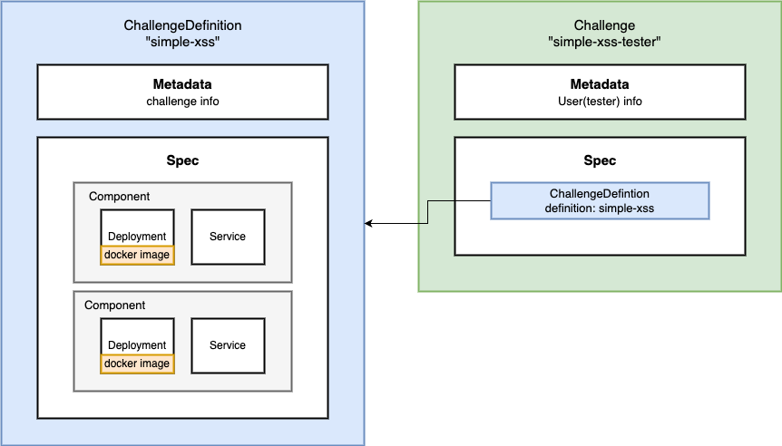

# challenge-operator

CTF 대회에서 사용자마다 시스템 문제처럼 고유한 환경을 가지고 있어야 하는 문제 유형이 있습니다. 이는 일반 컨테이너로 구현하기에는 한계가 있습니다.
이러한 문제를 쿠버네티스 오퍼레이터 패턴을 통해 해결하고자 합니다.
전반적으로 AWS CloudFormation Template 컨셉을 차용했습니다. Template으로 리소스를 생성하는 것처럼 ChallengeDefinition을 정의하여 Challenge를 생성할 수 있게 설계했습니다.

## Description

문제 출제자는 `ChallengeDefinition`이라는 쿠버네티스 커스텀 리소스를 정의하여 문제를 등록할 수 있습니다.

해킹 대회 참여자는 기타 대회 플랫폼(ex. DreamHack)처럼 IP과 포트 번호를 제공받습니다. 참여자는 해당 정보를 가지고 문제를 풀 수 있습니다.

## ChallengeDefinition

### 구성

문제를 등록하기 위해서는 ChallengeDefinition이라는 쿠버네티스 커스텀 리소스(CR)를 정의해야 합니다.

> [!NOTE]
> 추후 별도의 문서로 정리될 예정입니다.

##### Spec

|    Key     | Type              | Default | Description                 |
| :--------: | ----------------- | ------- | --------------------------- |
|   isOne    | nullable, boolean | False   | 하나만 생성할 경우에만 True |
| components | []Component       |         | 쿠버네티스 리소스           |

###### Component

deployment와 service는 쿠버네티스 정의서대로 작성하시면 됩니다.

|    Key     | Type   | Description       |
| :--------: | ------ | ----------------- |
|    name    | string | 컴포넌트 이름     |
| deployment | \*     | Deployment 정의서 |
|  service   | \*     | Service 정의서    |

### 예시

[web(nginx + flask) ChallengeDefinition](./sample/definition/web-basic.yaml) 샘플을 확인해주시길 바랍니다.

## 블로그

정확한 제작 과정은 [블로그](https://medium.com/s0okju-tech)에 지속적으로 업로드하고 있습니다.

## License

Copyright 2024.

Licensed under the Apache License, Version 2.0 (the "License");
you may not use this file except in compliance with the License.
You may obtain a copy of the License at

    http://www.apache.org/licenses/LICENSE-2.0

Unless required by applicable law or agreed to in writing, software
distributed under the License is distributed on an "AS IS" BASIS,
WITHOUT WARRANTIES OR CONDITIONS OF ANY KIND, either express or implied.
See the License for the specific language governing permissions and
limitations under the License.
